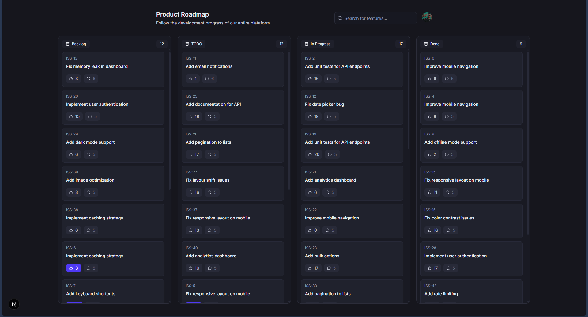
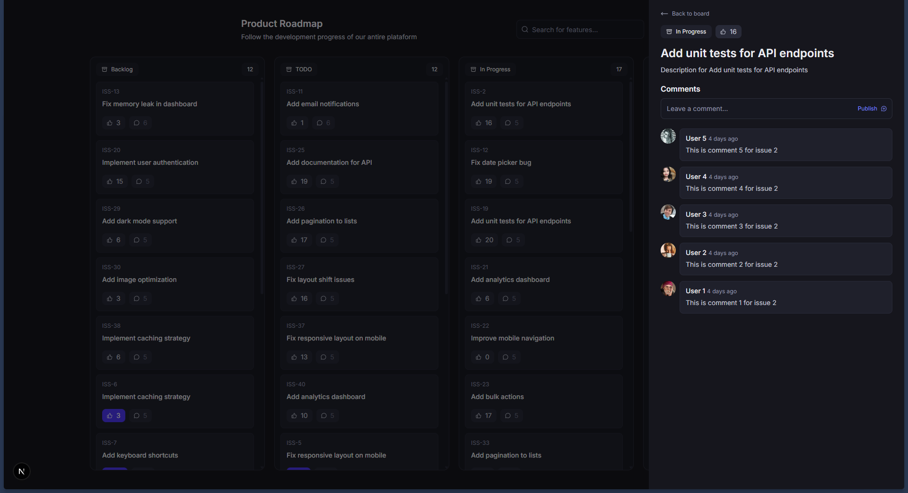
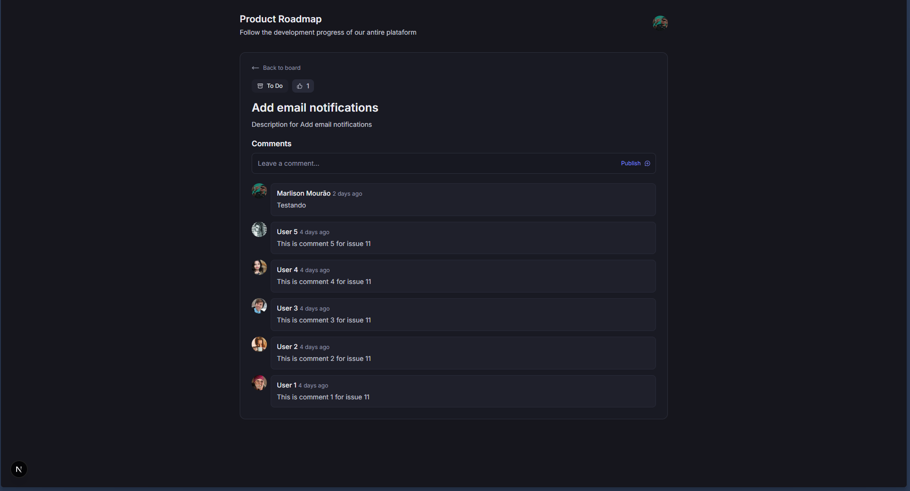

# Board - Gerenciador de Issues



## 📋 Sobre o Projeto

O **Board** é uma aplicação moderna de gerenciamento de issues (tarefas) inspirada pela simplicidade e eficiência de ferramentas de rastreamento de problemas. O projeto permite visualizar, criar e gerenciar tarefas de forma organizada, utilizando uma interface intuitiva e recursos avançados de navegação.

Este projeto foi desenvolvido como parte de um desafio técnico para demonstrar habilidades em tecnologias modernas do ecossistema React/Next.js.

## 🚀 Tecnologias

O projeto utiliza o que há de mais moderno em desenvolvimento web:

- **Framework**: [Next.js 16 (App Router)](https://nextjs.org/)
- **Estilização**: [Tailwind CSS v4](https://tailwindcss.com/)
- **Linguagem**: [TypeScript](https://www.typescriptlang.org/)
- **Autenticação**: [Better-Auth](https://www.better-auth.com/)
- **Persistência**: [Drizzle ORM](https://orm.drizzle.team/) com [PostgreSQL](https://www.postgresql.org/)
- **API**: [Hono](https://hono.dev/) (integrada para maior performance)
- **Gerenciamento de Estado**: [TanStack React Query v5](https://tanstack.com/query/latest)
- **Componentes de UI**: [Radix UI](https://www.radix-ui.com/) e [Lucide Icons](https://lucide.dev/)
- **Padronização**: [Biome](https://biomejs.dev/) (Lint & Format)

## 📸 Screenshots

Aqui estão algumas capturas de tela das principais funcionalidades:

### Detalhes da Issue (Modal e Página)
O projeto utiliza **Intercepting Routes** e **Parallel Routes** do Next.js para fornecer uma experiência de usuário fluida, onde é possível visualizar detalhes de uma issue sem perder o contexto do board.

| Detalhes via Modal | Página de Detalhes Completa |
|:---:|:---:|
|  |  |

## ✨ Funcionalidades

- [x] **Visualização em Board**: Listagem de issues com filtros.
- [x] **Páginas de Detalhes**: Cada issue possui uma página dedicada e acessível.
- [x] **Navegação Inteligente**: Abertura de detalhes em modal mantendo o estado da página anterior através de rotas interceptadas.
- [x] **Gestão de Comentários**: Possibilidade de interagir com as issues.
- [x] **Autenticação Segura**: Fluxo completo de login e gerenciamento de sessão.
- [x] **Performance Otimizada**: Utilização de `server-only` para segurança e React Compiler para renderização eficiente.

## 🛠️ Como rodar o projeto

### Pré-requisitos
- Node.js installed (LTS recomendado)
- Docker (opcional, para o banco de dados)
- pnpm (recomendado)

### Instalação

1. Clone o repositório:
```bash
git clone https://github.com/marlisonmourao/board.git
cd board
```

2. Instale as dependências:
```bash
pnpm install
```

3. Configure as variáveis de ambiente (.env):
Crie um arquivo `.env` na raiz do projeto com base no seu ambiente local (PostgreSQL e AUTH).

4. Rode as migrations e o seed do banco:
```bash
pnpm db:generate
pnpm db:push
pnpm db:seed
```

5. Inicie o servidor de desenvolvimento:
```bash
pnpm dev
```

Abra `http://localhost:3000` no seu navegador.
